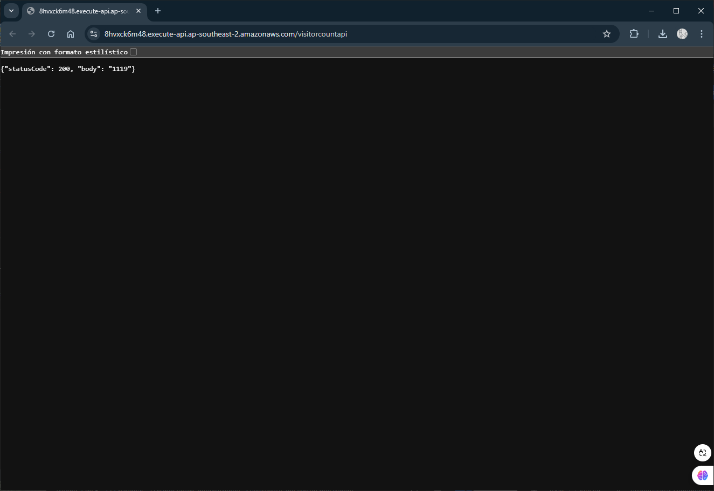
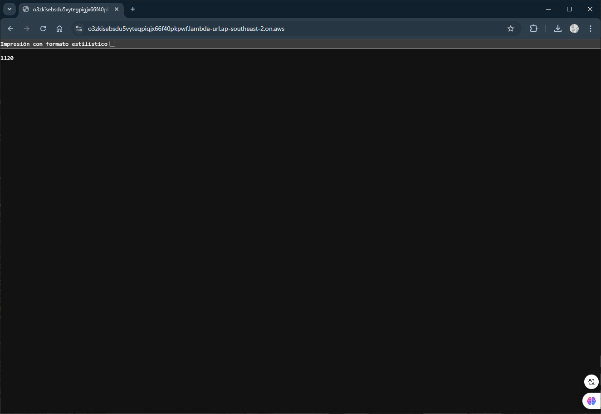
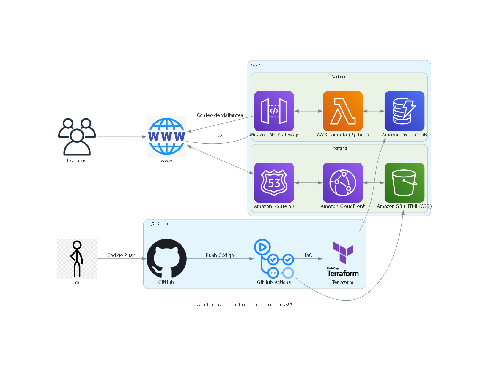
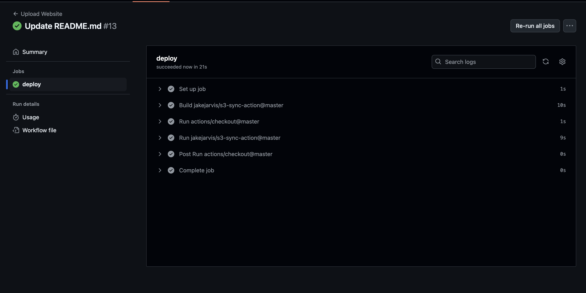
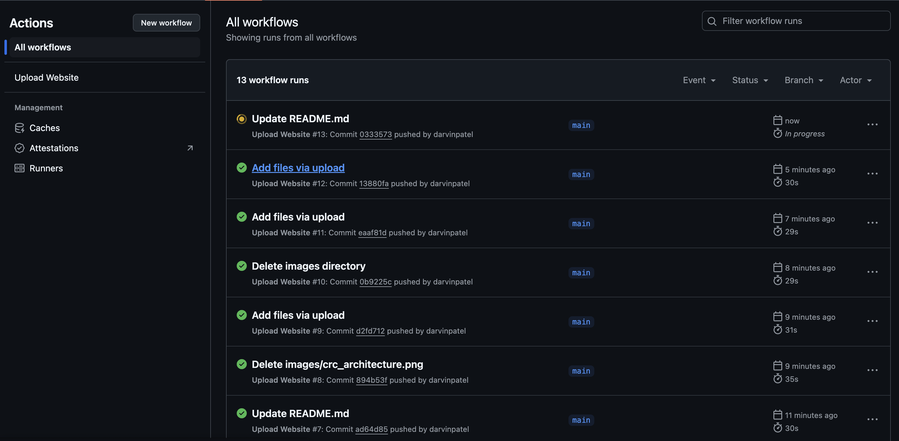

# Currículum en la Nube de AWS

## Resumen

Amazon Web Services (AWS) crear un sitio web estilo currículum, alojado completamente en infraestructura sin servidor de AWS. A continuación, se describen los servicios utilizados y su funcionamiento:

- Plantilla usada - [Plantilla](https://www.styleshout.com/free-templates/ceevee/)

- Activador de API en API Gateway - [API](https://8hvxck6m48.execute-api.ap-southeast-2.amazonaws.com/visitorcountapi)  
  
- Activador de función Lambda - [Llamada a Lambda](https://o3zkisebsdu5vytegpigjx66f40pkpwf.lambda-url.ap-southeast-2.on.aws/)  
  

## Tecnologías Utilizadas

- **Servicios de AWS:**
  - Route53
  - CloudFront
  - Certificate Manager
  - Amazon S3
  - API Gateway
  - AWS Lambda
  - DynamoDB
  - IAM

- **Herramientas y Frameworks:**
  - Git
  - HTML, CSS, JavaScript
  - Terraform de HashiCorp
  - GitHub Actions
 

## Estructura del Proyecto

- **`/frontend`**: Contiene el código fuente del sitio web del currículum.
- **`/infra`**: Incluye los módulos de Terraform creados para definir la infraestructura de AWS.
- **`.github/workflows/front-end-cicd.yml`**: Configuración de CI/CD con GitHub Actions para el despliegue.
- **`/images`**: Capturas de pantalla para este README que muestran la arquitectura.

## Arquitectura

> Construyendo el currículum como un sitio web en AWS

## WEB

### 1. HTML/CSS 
Escribí mi currículum como una página HTML y utilicé CSS para el diseño, usé una plantilla de internet que modifiqué.

### 2. CI/CD del Frontend
Una vez listo el código HTML, implementé CI/CD para el frontend.
Utilicé GitHub Actions para la canalización de CI/CD. Cuando subí el código a mi repositorio en GitHub, GitHub Actions sincronizó todo con un bucket de S3 y lo hizo público como un sitio web estático.

### 3. Hacer funcional el sitio web
Aquí comienza lo interesante: ya tenemos nuestro sitio estático y un dominio registrado. Ahora los conectamos.

- Creé una entrada en Hosted Zone con Route 53 y agregué los registros correspondientes.
- Configuré una distribución en CloudFront para que el sitio esté disponible desde ubicaciones de borde.

También aseguré que el sitio redirigiera siempre a HTTPS, creando un certificado en AWS Certificate Manager y conectándolo a CloudFront.

### 4. Configuración del Backend

Para el backend, utilicé **API Gateway**, **Lambda** y **DynamoDB** para almacenar y recuperar el contador de visitantes.  
- Primero creé una tabla en DynamoDB para almacenar el número de visitantes.  
- Luego desarrollé una función Lambda en Python que consulta DynamoDB para obtener y actualizar el contador de visitantes cada vez que se accede al sitio.

### 5. Infraestructura como Código (IaC)

Construí toda la infraestructura con Terraform 💯, sin usar la interfaz gráfica de AWS. Esto me ayudó a profundizar mis conocimientos sobre Terraform.

### 6. Canalización CI/CD

Utilicé GitHub Actions para automatizar el flujo de trabajo.

- Las acciones del frontend verifican el código HTML/CSS y lo sincronizan con el bucket S3.

- Las acciones del backend incluyen dos flujos de trabajo:
  - **Terraform Plan**
  - **Terraform Apply** (configurado para ejecutarse solo si el código se fusiona de una rama secundaria a la rama principal).

### 8. Contador de Visitantes

Finalmente, añadí un contador de visitantes al sitio.  
Incluí un script en JavaScript en el sitio web que llama al API Gateway. Este activa la función Lambda, que actualiza el contador en DynamoDB y devuelve el número actualizado para mostrarlo en la página.

Ahora tengo el currículum alojado en AWS, con la capacidad de rastrear cuántas personas han visitado el sitio .